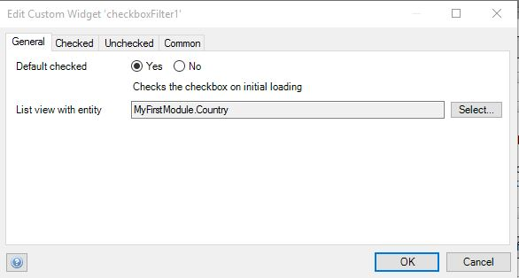

# Checkbox Filter
Enable users to filter a list view at run time, with various constraints when checked or unchecked

## Features
* Filter items by an attribute
* Filter items by XPath
* Configure filter actions when the widget is checked
* Configure filter actions when the widget is unchecked
* Set a checked checkbox as default
* Supports multiple filters on the same list view

## Dependencies
Mendix 7.6

## Demo project
[https://checkboxfilter.mxapps.io/](https://checkboxfilter.mxapps.io/)

## Usage

Configure the widget as below.

Provide the entity name for the target list view.

Set up filter actions to be applied when the widget is checked.

Set up filter actions to be applied when the widget is unchecked

When filtering by `Attribute`, select an attribute and input an attribute value to filter by.

    - For 'Boolean' datatype use `true` or `false` string.
    - For 'Enumeration' datatype use the enumeration name/key not 'caption'
When filtering by `XPath`, input a constraint to filter by.
`None` is for an empty option which resets the filter then selected.

**NB: The widget connects to the first listview it finds from within its parent container and outer wards.** 

## Issues, suggestions and feature requests
Please report issues at [https://github.com/mendixlabs/checkbox-filter/issues](https://github.com/mendixlabs/checkbox-filter/issues).

## Development and contribution
Please follow [development guide](/development.md).
